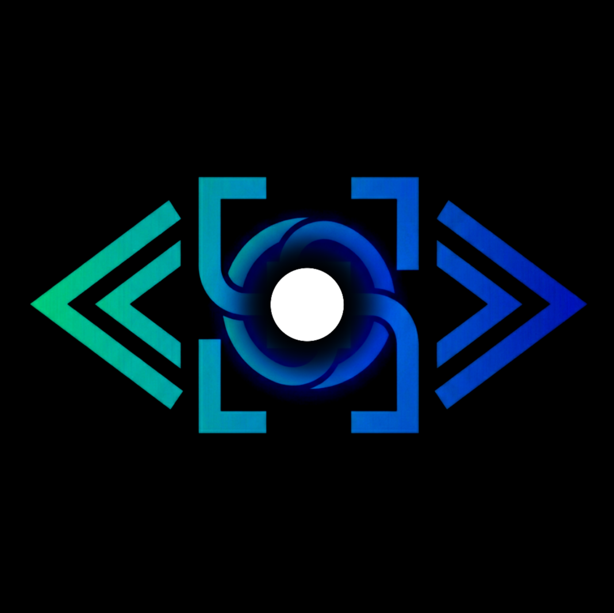

# Sentrits

<p align="center">
  
</p>

**Persistent CLI coding sessions across devices — with supervision, control handoff, and real execution continuity.**

Sentrits is a session runtime and control plane for AI coding CLIs.

It keeps real Codex, Claude Code, Aider, Gemini CLI, and similar terminal workflows alive on a host machine while letting you:

- attach and detach without losing the running session
- observe the same session from multiple devices
- hand control between desktop, [Sentrits-Web](https://github.com/shubow-sentrits/Sentrits-Web), and [Sentrits-IOS](https://github.com/shubow-sentrits/Sentrits-IOS) clients
- reconnect with useful terminal state instead of waiting for luck or repaint timing

Sentrits is built for **supervision and intervention**, not for turning your phone into a full IDE.

---

## Contents

- [Why Sentrits Exists](#why-sentrits-exists)
- [What Sentrits Does Today](#what-sentrits-does-today)
- [What Makes Sentrits Different](#what-makes-sentrits-different)
- [Architecture At A Glance](#architecture-at-a-glance)
- [Current Scope](#current-scope)
- [Start Here](#start-here)

---

## Why Sentrits Exists

Modern AI coding workflows are no longer simple request/response interactions.

They are often:

- long-running
- stateful
- CLI-native
- spread across build/test/fix loops
- worth watching even when you are away from your desk

Today, most tools solve only part of that problem:

- **SSH** gives you machine access, but not a session-aware supervision model
- **cloud/web AI tools** preserve conversation and context, but usually not the exact live execution environment you started locally
- **Sentrits** focuses on a different layer: keeping the **actual CLI execution** alive, inspectable, and controllable across devices

In short:

* **Sentrits preserves the running session itself.**

---

## What Makes Sentrits Different

| System | Primary abstraction | What it preserves |
|---|---|---|
| SSH | machine connection | remote access |
| tmux | terminal multiplexing | terminal continuity on one host |
| Claude/Cursor remote-style workflows | model/context continuity | cloud/web/mobile AI context |
| **Sentrits** | **persistent session runtime** | **live CLI execution across devices** |

Sentrits is not another remote shell.

It is a **session system** for long-lived CLI execution.

---

## What Sentrits Does Today

Sentrits currently provides:

- **persistent PTY-backed sessions**
  - start once, reattach later, keep the live process running
  - useful for long-running build/test/fix loops that you do not want to restart just because you changed devices

- **multi-observer, single-controller runtime**
  - many clients may watch a session
  - exactly one principal owns terminal input at a time
  - useful when you want to observe first and intervene only when needed

- **cross-device control handoff**
  - switch active control between host, web, and iOS without restarting the workflow
  - useful for continuing a session from phone, web, or another desktop without resetting the live process

- **pairing and host identity**
  - discover and trust hosts, then reconnect to known sessions

- **session snapshot and bootstrap state**
  - reconnect with useful state instead of relying entirely on fresh repaint behavior from the app inside the PTY
  - useful when a session is already active and you need a meaningful first frame instead of an empty or half-repainted terminal

- **CLI-agnostic compatibility**
  - works with real terminal-based tools rather than one provider’s private execution model

- **coarse runtime supervision**
  - activity/quiet state, session updates, and attention-oriented signals
  - useful for watch/intervene workflows where raw terminal bytes alone are not enough

- **across-device agent session network**
  - the architecture already supports a network of real running agent sessions across devices and hosts
  - current work is focused on making that network more legible through stronger session-node, supervision, and semantic representation

---

## Architecture At A Glance

```text
                  ┌─────────────────────────────────────┐
                  │              Clients                │
                  │                                     │
                  │  CLI         Web         iOS        │
                  │  local       remote      remote     │
                  │  attach      observe/    observe/   │
                  │  observe     control     control    │
                  └────────────────┬────────────────────┘
                                   │
                      REST + WebSocket observer/control
                                   │
                     ┌─────────────▼─────────────┐
                     │      sentrits daemon      │
                     │                           │
                     │ session manager           │
                     │ auth + pairing            │
                     │ inventory + snapshots     │
                     │ terminal multiplexer      │
                     │ supervision + attention   │
                     └─────────────┬─────────────┘
                                   │
                            one PTY per session
                                   │
                      ┌────────────▼────────────┐
                      │ AI coding CLI process   │
                      │ Codex / Claude / Aider  │
                      └────────────┬────────────┘
                                   │
                    PTY output + workspace/git/process signals
```

More detail:

- `development_memo/system_architecture.md`
- `development_memo/architecture_refined.md`

---

## Current Scope

Sentrits is currently focused on:

- persistent PTY-backed session runtime
- cross-device observe/control
- pairing, identity, and inventory
- mobile-first supervision rather than heavy editing
- packaging the daemon/runtime as the product core
- local-network workflows built around LAN reachability and UDP discovery
- maintained clients:
  - Web: `https://github.com/shubow-sentrits/Sentrits-Web`
  - iOS: `https://github.com/shubow-sentrits/Sentrits-IOS`

Sentrits is **not** currently trying to solve:

- internet relay/brokered connectivity as a first-class managed service
- full IDE-style editing on mobile
- perfect semantic understanding of every terminal workflow
- complete multi-user account systems

---

## Start Here

- `get_started.md`
- `VIBING.md`
- `development_memo/README.md`
- `development_memo/system_architecture.md`
- `development_memo/api_and_event_schema.md`
- `development_memo/mvp_checklist.md`
- `development_memo/known_limitations.md`
